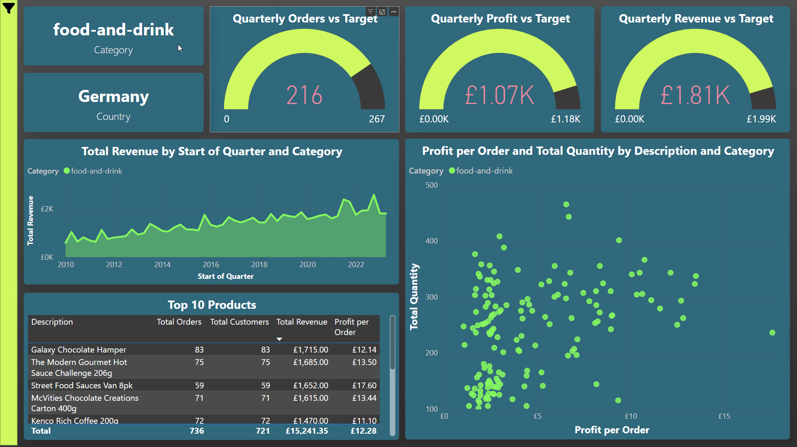
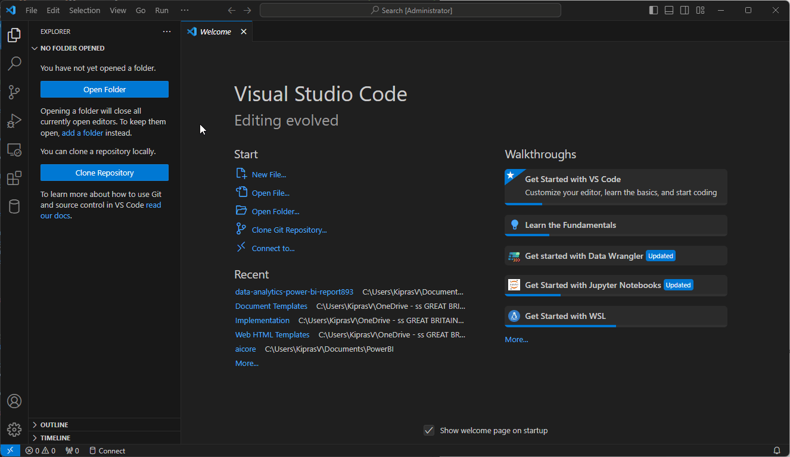
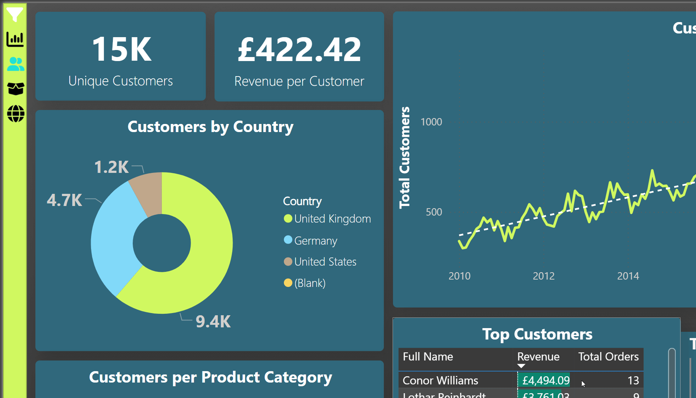

> Note: the customer data in this exercise is synthetic and doesn't actually represent real people.


<!-- Improved compatibility of back to top link: See: https://github.com/othneildrew/Best-README-Template/pull/73 -->
<a id="readme-top"></a>

[![Contributors][contributors-shield]][contributors-url]
[![project_license][license-shield]][license-url]
[![LinkedIn][linkedin-shield]][linkedin-url]

<div style="text-align: center"></img></div>

<h3 align="center">Data Analytics Power BI Report</h3>
  <p align="center">
A 4 page report with a nav-bar, fancy tooltips and sleek modern design, based on a 120k record sample database.
    <br />
    <a href="https://github.com/kiprenzo/Data-Analytics-Power-BI-Report/wiki"><strong>See more in the Wiki</strong></a>
    <br />
    <br />
    <a href="https://github.com/kiprenzo/Data-Analytics-Power-BI-Report/wiki">View Demo</a>
  </p>
</div>


<!-- TABLE OF CONTENTS -->
<details>
  <summary>Table of Contents</summary>
  <ol>
    <li>
      <a href="#about-the-project">About The Project</a>
    </li>
    <li>
      <a href="#getting-started">Getting Started</a>
      <ul>
        <li><a href="#prerequisites">Prerequisites</a></li>
        <li><a href="#installation">Installation</a></li>
      </ul>
    </li>
    <li><a href="#usage">Usage</a></li>
    <li><a href="#license">License</a></li>
    <li><a href="#contact">Contact</a></li>
  </ol>
</details>


<!-- ABOUT THE PROJECT -->
## About The Project
In this project I:
- Performed ETL on a sample 120,000-record e-commerce data-set, extracting data
from Azure Storage and Azure SQL Database accounts into Power BI
- Transformed and cleaned data using Power Query to form a star-based
schema data model including a custom date table, and implemented 25 DAX
measures to support visualisations and time intelligence
- Created a 4-page report in Power BI containing 40 visualisations
- Constructed 5 SQL queries for the same data to generate insights for use
outside of the Power BI environment.

<!-- GETTING STARTED -->
## Getting Started

This is an example of how you may give instructions on setting up your project locally.
To get a local copy up and running follow these simple steps.

### Installation

1. Download & install Power BI Desktop [from Microsoft](https://www.microsoft.com/en-us/download/details.aspx?id=58494).
2. Clone the repo
   ```sh
   git clone https://github.com/kiprenzo/Data-Analytics-Power-BI-Report.git
   ```
   If you're new to git, the easiest way to clone a repo would be through Visual Studio Code.
<div style="text-align: center"></img></div>
<p align="right">(<a href="#readme-top">back to top</a>)</p>

2a. OR simply download the `report.pbix` file and you're good to go.

<!-- USAGE EXAMPLES -->
## Usage

When exploring the report, remember that if you are using Power BI Desktop, you should Ctrl+Click to use buttons (like in the nav bar).

<div style="text-align: center"></img></div>

_For more examples, please refer to the [Wiki.](https://github.com/kiprenzo/Data-Analytics-Power-BI-Report/wiki)_

<p align="right">(<a href="#readme-top">back to top</a>)</p>


<!-- LICENSE -->
## License

Distributed under the MIT License. See `LICENSE.txt` for more information.

<!-- CONTACT -->
## Contact
Feel free to reach out.
[![LinkedIn][linkedin-shield]][linkedin-url]
Kipras Varanavicius - kipras.varanavicius@gmail.com


Project Link: [https://github.com/kiprenzo/Data-Analytics-Power-BI-Report](https://github.com/kiprenzo/Data-Analytics-Power-BI-Report)

<p align="right">(<a href="#readme-top">back to top</a>)</p>

<!-- MARKDOWN LINKS & IMAGES -->
<!-- https://www.markdownguide.org/basic-syntax/#reference-style-links -->
[contributors-shield]: https://img.shields.io/github/contributors/kiprenzo/Data-Analytics-Power-BI-Report.svg?style=for-the-badge
[contributors-url]: https://github.com/kiprenzo/Data-Analytics-Power-BI-Report/graphs/contributors
[forks-shield]: https://img.shields.io/github/forks/kiprenzo/Data-Analytics-Power-BI-Report.svg?style=for-the-badge
[forks-url]: https://github.com/kiprenzo/Data-Analytics-Power-BI-Report/network/members
[stars-shield]: https://img.shields.io/github/stars/kiprenzo/Data-Analytics-Power-BI-Report.svg?style=for-the-badge
[stars-url]: https://github.com/kiprenzo/Data-Analytics-Power-BI-Report/stargazers
[issues-shield]: https://img.shields.io/github/issues/kiprenzo/Data-Analytics-Power-BI-Report.svg?style=for-the-badge
[issues-url]: https://github.com/kiprenzo/Data-Analytics-Power-BI-Report/issues
[license-shield]: https://img.shields.io/github/license/kiprenzo/Data-Analytics-Power-BI-Report.svg?style=for-the-badge
[license-url]: https://github.com/kiprenzo/Data-Analytics-Power-BI-Report/blob/master/LICENSE.txt
[linkedin-shield]: https://img.shields.io/badge/-LinkedIn-black.svg?style=for-the-badge&logo=linkedin&colorB=555
[linkedin-url]: https://linkedin.com/in/kiprasv
[product-screenshot]: images/screenshot.png
[Next.js]: https://img.shields.io/badge/next.js-000000?style=for-the-badge&logo=nextdotjs&logoColor=white
[Next-url]: https://nextjs.org/
[React.js]: https://img.shields.io/badge/React-20232A?style=for-the-badge&logo=react&logoColor=61DAFB
[React-url]: https://reactjs.org/
[Vue.js]: https://img.shields.io/badge/Vue.js-35495E?style=for-the-badge&logo=vuedotjs&logoColor=4FC08D
[Vue-url]: https://vuejs.org/
[Angular.io]: https://img.shields.io/badge/Angular-DD0031?style=for-the-badge&logo=angular&logoColor=white
[Angular-url]: https://angular.io/
[Svelte.dev]: https://img.shields.io/badge/Svelte-4A4A55?style=for-the-badge&logo=svelte&logoColor=FF3E00
[Svelte-url]: https://svelte.dev/
[Laravel.com]: https://img.shields.io/badge/Laravel-FF2D20?style=for-the-badge&logo=laravel&logoColor=white
[Laravel-url]: https://laravel.com
[Bootstrap.com]: https://img.shields.io/badge/Bootstrap-563D7C?style=for-the-badge&logo=bootstrap&logoColor=white
[Bootstrap-url]: https://getbootstrap.com
[JQuery.com]: https://img.shields.io/badge/jQuery-0769AD?style=for-the-badge&logo=jquery&logoColor=white
[JQuery-url]: https://jquery.com 

