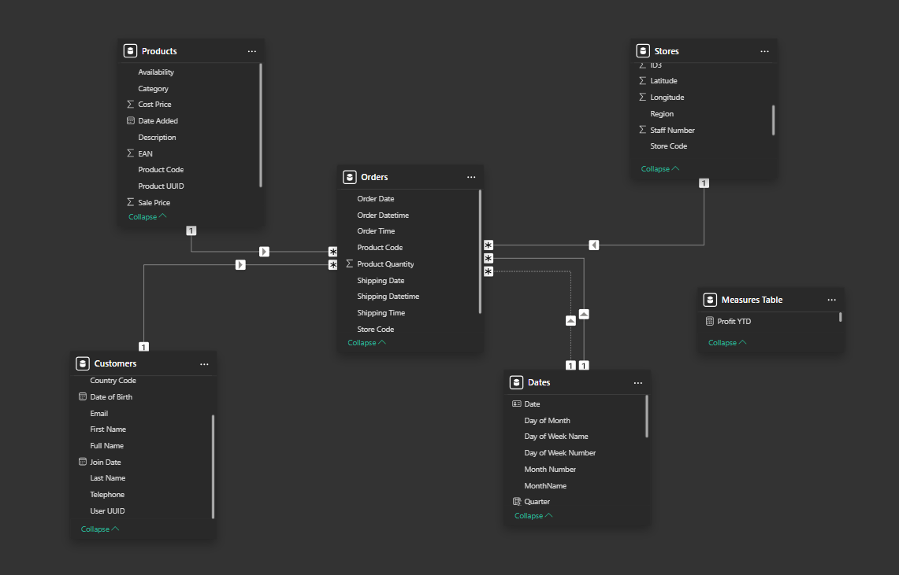
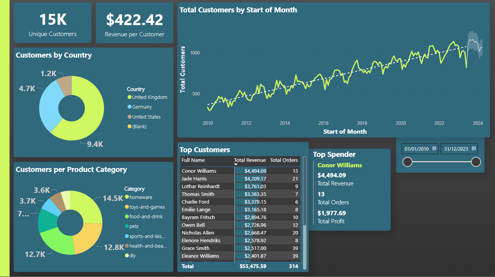
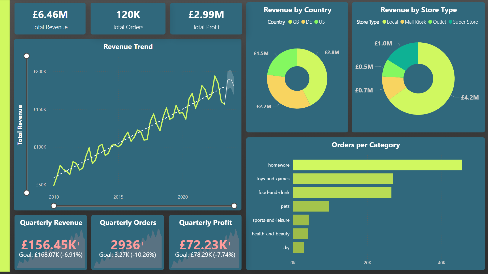

# Data Analytics Power BI Report

In this project I:
- Performed ETL on a 120,000-record e-commerce data-set, extracting data
from Azure Storage and Azure SQL Database accounts into Power BI
- Transformed and cleaned data using Power Query to form a star-based
schema data model including a custom date table, and implemented 25 DAX
measures to support visualisations and time intelligence
- Created a 4-page report in Power BI containing 40 visualisations
- Constructed 5 SQL queries for the same data to generate insights for use
outside of the Power BI environment.

### Step 1. Import Data

</img>

To simulate a real-world scenario, I imported data from a variety of data sources, including an Azure SQL DB, an Azure Blob Storage account, and web-hosted .csv files. I then performed data cleaning by removing irrelevant columns, splitting datetime details, concatenating other columns, maintaining data consistency and tidy naming conventions.

### Step 2. Build Data Model

</img>

I created a star-schema by centring the data around the `Orders` fact table,
and establishing one-to-many relationships with the various dimension tables.

This includes creating a date table from an M query, which dynamically chooses the fact table's earliest date as the start and the last as the end. This means as the data gets updated, so does the date table.

### Step 3. Customer Detail Page

</img>

I started with a page called `Customer Detail`, which focused on the people bringing business to the organization.

I included visuals with customer by country & by product category breakdowns. I then graphed the trend of the total customer count per month as well as forecasting, with seasonality in mind, into the future.

### Step 4. Executive Summary Page

</img>

This page is meant for the exec team of our fictional org, for a high-level overview of the company's performance. We have visuals for three quarterly KPIs, each with their own target calculations; some donut & bar charts to see the split between product category, country & store type revenue; and a line graph of the revenue trend, again with forecasting.

### Step 5. Product Detail Page

</img>

For this page, the focus was on hitting targets, the progress for which was displayed via the gauge visual, and tracking the most profitable and successful products.

I also began work on the navigation bar on the left of every page, in this case by adding a **slicer button**. This utilizes PowerBI's bookmarks feature to save several states of the report, hiding and unhiding visuals, and works neatly as a pop-out menu that would otherwise be cluttering the report.

